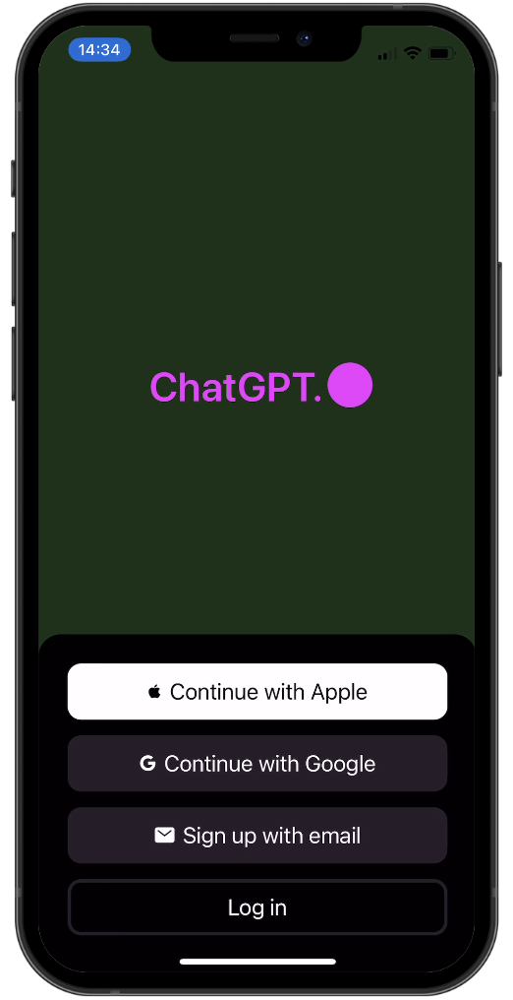
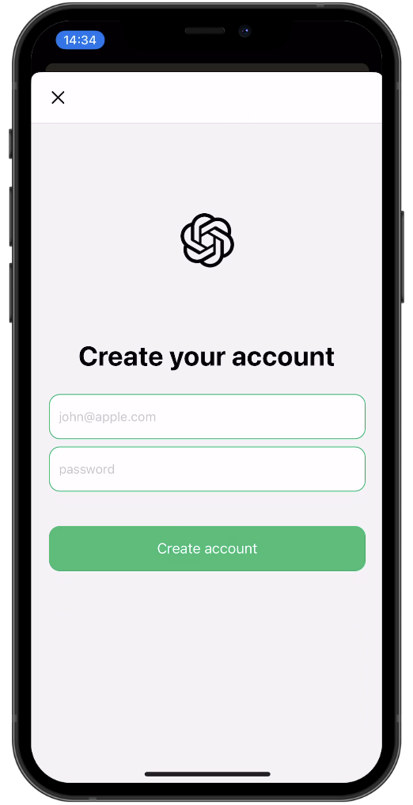
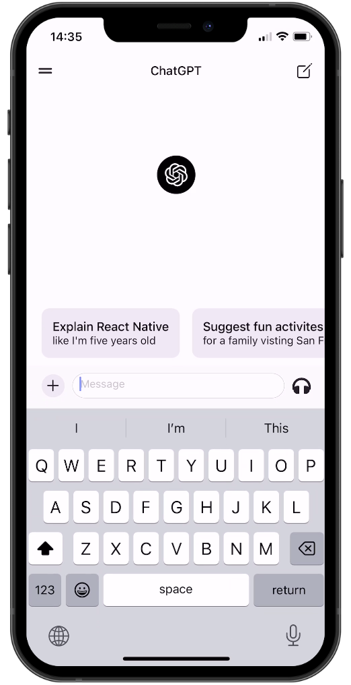
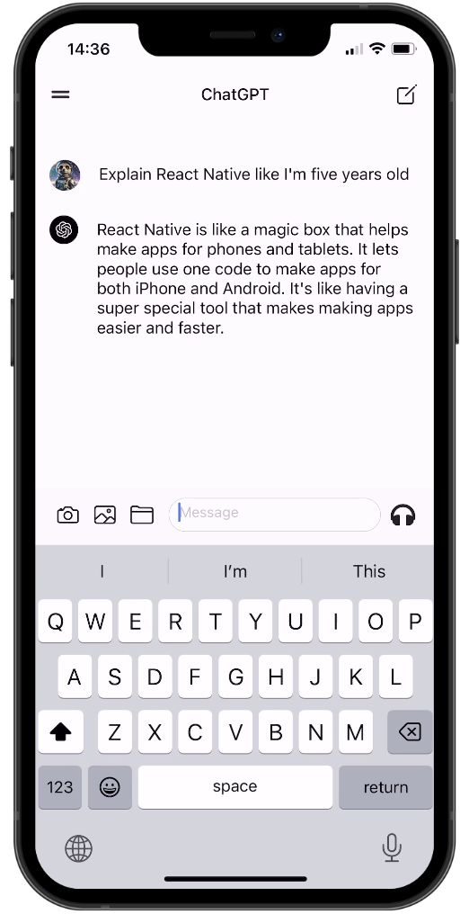
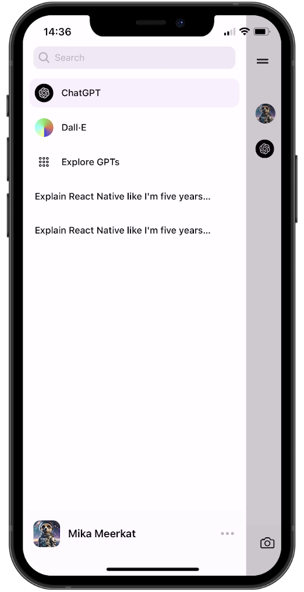
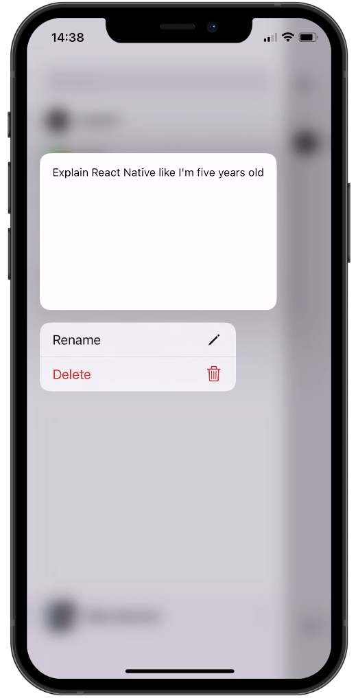

# @aiascendedlabs/devops-pocket-pa

> React Native ChatGPT-clone UI kit — packaged from [`Galaxies-dev/chatgpt-clone-react-native`](https://github.com/Galaxies-dev/chatgpt-clone-react-native) and published to GitHub Packages so any of your projects can install it with a single command instead of cloning the whole repo.

---

## 📦 Install as a package

> **Requires** a GitHub personal access token (PAT) with `read:packages` scope.

**1. Add the registry to your project's `.npmrc`:**

```
@aiascendedlabs:registry=https://npm.pkg.github.com
//npm.pkg.github.com/:_authToken=${GITHUB_TOKEN}
```

**2. Install:**

```bash
npm install @aiascendedlabs/devops-pocket-pa
# or
yarn add @aiascendedlabs/devops-pocket-pa
```

**3. Import components and providers:**

```tsx
import {
  AnimatedIntro,
  BottomLoginSheet,
  ChatMessage,
  ChatPage,
  DropDownMenu,
  HeaderDropDown,
  MessageIdeas,
  MessageInput,
  RevenueCatProvider,
} from '@aiascendedlabs/devops-pocket-pa';
```

---

## 🔑 Required environment variables

Create a `.env` file (see [`DUMMY.env`](./DUMMY.env) for the template):

```
EXPO_PUBLIC_CLERK_PUBLISHABLE_KEY=pk_live_...
EXPO_PUBLIC_RC_APPLE_KEY=appl_...
EXPO_PUBLIC_RC_GOOGLE_KEY=goog_...
```

---

## 🔄 Staying synced with upstream

This repo tracks `Galaxies-dev/chatgpt-clone-react-native`. To pull in upstream changes:

```bash
git remote add upstream https://github.com/Galaxies-dev/chatgpt-clone-react-native.git
git fetch upstream
git merge upstream/main
```

Then bump the version in `package.json` and push — the [publish workflow](./.github/workflows/publish.yml) will automatically publish the new version to GitHub Packages on every version tag (`v*`).

---

## 🚀 Run as a standalone app (original workflow)

```bash
npm install
npx expo start
```

---

## Features

- [Expo Router](https://docs.expo.dev/routing/introduction/) file-based navigation
- [Clerk](https://go.clerk.com/wvMHe8T) authentication
- [RevenueCat](https://www.revenuecat.com/) in-app purchases
- [OpenAI API](https://platform.openai.com/) GPT chat completions & DALL-E image generation
- [Reanimated](https://docs.swmansion.com/react-native-reanimated/) 3 animations
- [Expo SQLite](https://docs.expo.dev/versions/latest/sdk/sqlite-next/) chat persistence
- [FlashList](https://shopify.github.io/flash-list/) efficient list rendering
- [Bottom Sheet](https://ui.gorhom.dev/components/bottom-sheet/), [Zeego](https://zeego.dev/start) native menus, MMKV storage, and more

## Screenshots

<div style="display: flex; flex-direction: 'row';">






</div>

---

> Original project by [Galaxies.dev](https://galaxies.dev). Packaging and maintenance by [aiascendedlabs](https://github.com/aiascendedlabs).
